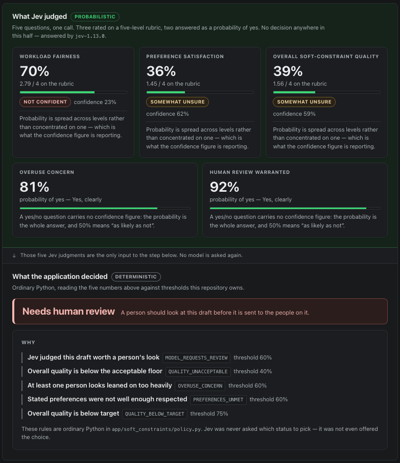

# Soft-constraint scheduling judgments with Jev

A small experiment: what happens if you let a language model judge only the
part of a scheduling problem that has no right answer, and keep everything else
in ordinary deterministic code.

It takes three invented scheduling drafts, asks [TypeSafe's Jev][typesafe] five
narrow questions about each, and turns the typed judgments that come back into
one application status using plain Python. The point is the seam between those
two halves.

> This experiment was inspired by work on a configurable volunteer scheduling
> system. It contains none of that system's code, rules or data. Every person,
> number and scenario here is invented.

### Ambiguous schedule example



*Equal assignment totals do not necessarily mean a good schedule. In this synthetic
case, Jev flags preference satisfaction and overuse concerns, while ordinary Python
applies the project's explicit thresholds and routes the draft to human review.*

[typesafe]: https://typesafe.ai

## What it demonstrates

A scheduler has two kinds of constraint, and they want completely different
machinery.

**Hard constraints have right answers.** Is this person qualified for this
role? Are they available that week? Are they already at the maximum number of
assignments they agreed to? Does this clash with a rule somebody configured?
Every one of those is a fact, a solver decides it exactly, and being 95%
confident about it is worthless - you need the answer. That work belongs in a
constraint solver, and this project assumes it has already happened.

**Soft constraints involve softer tradeoffs.** Is this a *fair* way to spread
the work? Has anybody been leaned on too heavily? Were people's stated
preferences respected well enough to send this out? These are judgments about
a situation rather than exact feasibility checks, which is where Jev is useful.

**But the model does not get to decide anything.** Jev returns probabilities.
What the application *does* about them - accept the draft, flag it, send it to
a person - is ordinary Python with thresholds you can read, test and change
without touching a prompt.

```
hard constraints   →  deterministic engine        (assumed satisfied here)
soft constraints   →  Jev, probabilities only
final status       →  deterministic Python policy
```

## Architecture

```
backend/app/
  soft_constraints/
    state.py        normalized input + exact arithmetic, computed in Python
    scenarios.py    three invented drafts, selected only by scenario ID
    questions.py    five typed Jev questions
    evaluator.py    the single TypeSafe seam + response parsing
    results.py      typed results, so callers never parse model output
    policy.py       Jev judgments → deterministic application status
  api/              two endpoints over the three fixed scenarios
  main.py           standalone FastAPI server

frontend/src/
  app/page.tsx      the complete demo UI
  app/api/jev-demo/ same-origin proxy, so the API key stays server-side
  lib/              transport, types, and presentation rules
```

### The five questions

Three `Score` questions on a five-level rubric and two `Noul` questions
(probability of yes), asked together in one request:

| Question | Type |
| --- | --- |
| workload fairness | Score |
| preference satisfaction | Score |
| overall soft-constraint quality | Score |
| overuse concern | Noul |
| human review warranted | Noul |

**There is deliberately no `Choice` question.** Jev could be asked to pick
`accept` / `review` / `rebalance` directly, and that was the first thing this
experiment tried. It is the wrong shape: the point at which a coordinator's
attention is worth interrupting is a policy the operator owns and will want to
tune; two runs over the same judgment must give the same status; and changing a
threshold should not cost an inference call. So the model is asked only what it
can genuinely judge, and `policy.py` decides.

### The deterministic policy

`policy.py` maps the probabilities onto `acceptable`, `attention` or
`human_review`. Every rule is evaluated - none short-circuits - so one call
reports everything at once, from a bounded vocabulary of reason codes. The
response includes the threshold each reason was measured against, so the page
can show the comparison rather than assert the conclusion.

Confidence is used as a second axis, not a second score: a quality rating the
model is *unsure* of routes to a human rather than being treated as a middling
rating.

## The three scenarios

Fixed, server-side, and the only input either endpoint accepts. There is no
request body anywhere - you cannot submit a roster, so no real person can
travel to a third-party API.

| | what it is | why it is here |
| --- | --- | --- |
| **`imbalanced`** | One volunteer takes all four events; three who were available take none. | The obvious bad case. |
| **`balanced`** | The same four events shared evenly, everyone inside the maximum they asked for. | The obvious good case. |
| **`ambiguous`** | Six volunteers with identical totals - but two are past the maximum they asked for. | The interesting one. Arithmetic alone calls this a fine schedule. Whether it *is* depends on things only a judgment weighs, which is the whole argument for having a model here at all. |

## Setup

Requires Python 3.11+ and Node 20+.

### 1. Get a TypeSafe API key

Sign up at [typesafe.ai][typesafe] and create a key. Then:

```bash
cp .env.example .env
# put your key in .env
```

`TYPESAFE_API_KEY` is the only credential needed for live evaluation. There is
no database, no authentication and no second service, so there is nothing else
to obtain. The key is read by the backend process only, at the moment an
evaluation is requested. It never reaches the browser.

`JEV_DEMO_API_URL` is an optional override - the only other variable the
project reads. It tells the frontend's proxy where to find the backend and
defaults to `http://127.0.0.1:8000`, which is where both start commands below
put it. Leave it unset unless you have moved the backend somewhere else.

### 2. Install, once

```bash
cd backend
python3 -m venv .venv
source .venv/bin/activate
pip install -e ".[dev]"
deactivate

cd ../frontend
npm install
```

### 3. Run it

After that first-time setup, this is the way to start the project - from the
repository root:

```bash
./dev.sh
```

It checks that the virtualenv and `.env` exist, loads `.env`, starts the
backend on port 8000 and the frontend on port 3000, and shuts both down
together on Ctrl-C.

Then open **http://localhost:3000**.

Without a key the backend still starts and the three scenarios still load with
their workload arithmetic; only *Evaluate with Jev* fails, and the page says
what to set.

### Starting the two halves by hand

`./dev.sh` is the recommended path. Running the processes separately is the
manual alternative - useful when one half is misbehaving and you want its logs
on their own terminal, or when the script itself will not run.

Backend:

```bash
cd backend
source .venv/bin/activate
set -a; source ../.env; set +a
python -m uvicorn app.main:app --reload --port 8000
```

Frontend, in a second terminal:

```bash
cd frontend
npm run dev
```

## Tests

Both suites are offline. **No automated test calls TypeSafe** - the backend
replaces the evaluator's one seam and an autouse fixture makes constructing a
real client an error; the frontend replaces `fetch`.

```bash
cd backend  && pytest                      # 108 tests
cd frontend && npm test                    # 76 tests
cd frontend && npm run typecheck && npm run lint && npm run build
```

Beyond the usual coverage of parsing and policy, the suites pin a few claims
that are easy to state and easy to quietly break:

- the backend imports no database, ORM or settings framework - checked in a
  clean subprocess with the environment stripped bare;
- the API accepts exactly three scenario names and no request body;
- no response carries the API key, the prompt text, or an SDK exception's own
  message;
- the browser never reads the key, stores anything, or sends a cookie;
- no threshold lives in the frontend - the status is the backend's.

## Everything here is synthetic

All three scenarios and all of the volunteer data in them are invented for this
demo - no draft, roster or person here came from a real schedule.
Every volunteer is `Volunteer A` through `Volunteer F`. The state sent to
TypeSafe is opaque labels and integers - no names, no contact details, no
dates, no organizations, no identifiers of any kind. There is no database in
this project, so there is nothing stored to leak. A test asserts the payload's
keys against a fixed permitted set rather than leaving that to review.

## Limitations

**This is an experiment, not production policy.**

- **The thresholds are not calibrated.** They are conservative starting values
  chosen by hand, not learned from outcomes. Real thresholds need real drafts
  and somebody's opinion of them; TypeSafe's own guidance is explicit about
  this. Do not copy these numbers into anything that matters.
- **Typed output guarantees the interface, not the truth.** A well-formed
  `3.4 / 4` is a well-formed number whether or not it is the right one. The
  suite proves the shape, never the judgment.
- **Three scenarios is not an evaluation set.** They were written to be
  legible, not representative. The intermediate `attention` policy status has
  also not reliably appeared in live runs.
- **No real scheduler is included.** The hard-constraint layer is described,
  not implemented - this project evaluates a finished draft and could not
  produce one.
- **Model versions move.** A judgment is only interpretable next to the model
  that made it, which is why every response names it.

## License

Released under the [MIT License](LICENSE).
